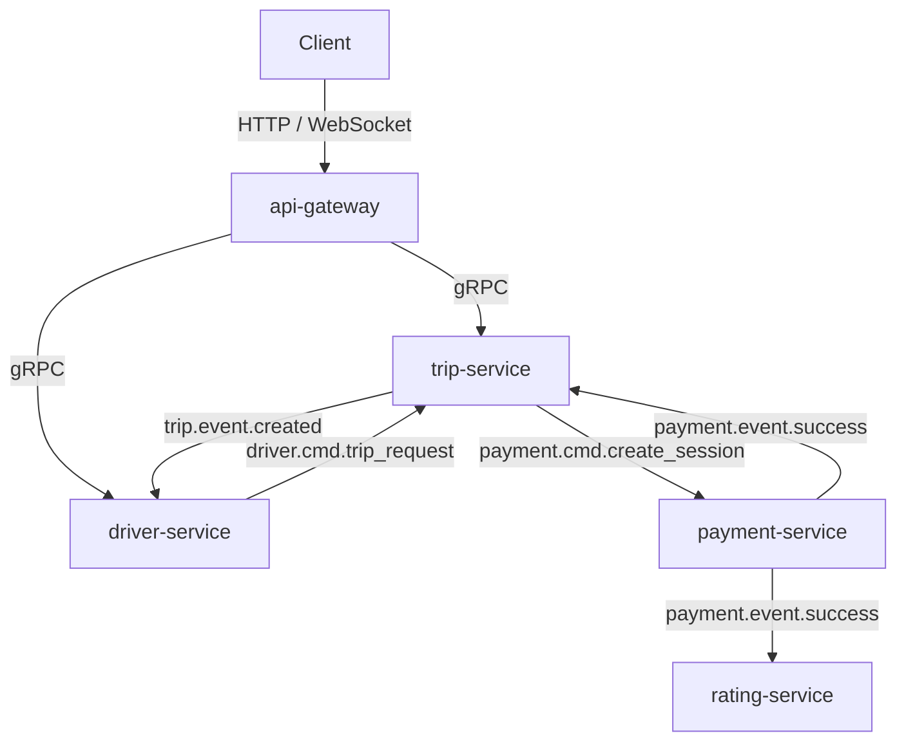

# TaxiGo

Backend for an Uber-style ride-sharing app built with Go microservices, gRPC, RabbitMQ, and Kubernetes.

## Architecture


```mermaid
graph TD
    Client -->|HTTP / WebSocket| api-gateway
    api-gateway -->|gRPC| trip-service
    api-gateway -->|gRPC| driver-service

    trip-service -->|payment.cmd.create_session| payment-service
    payment-service -->|payment.event.success| trip-service
    payment-service -->|payment.event.success| rating-service

    driver-service -->|driver.cmd.trip_request| trip-service
    trip-service -->|trip.event.created| driver-service
```

## Run

```bash
tilt up
```
